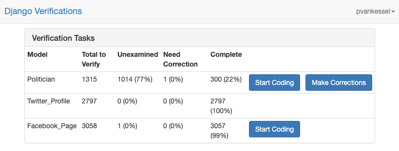
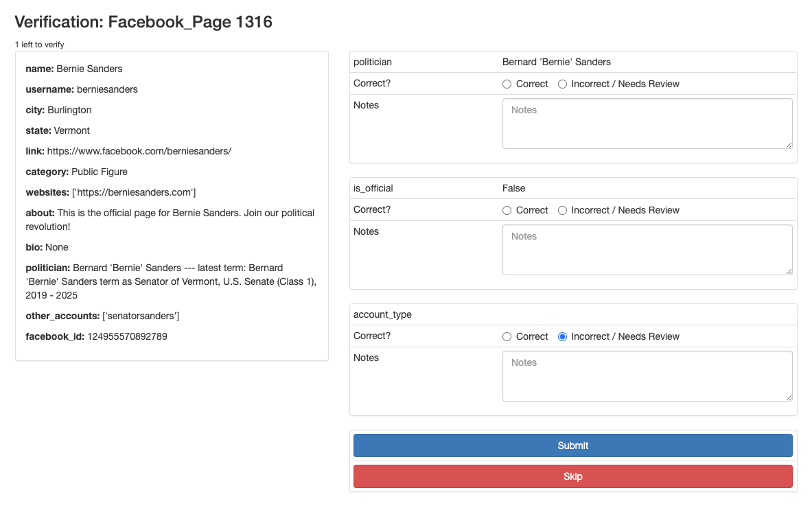
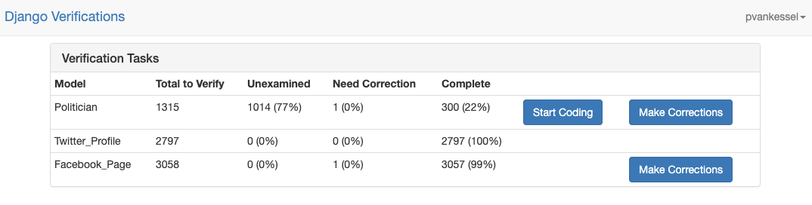
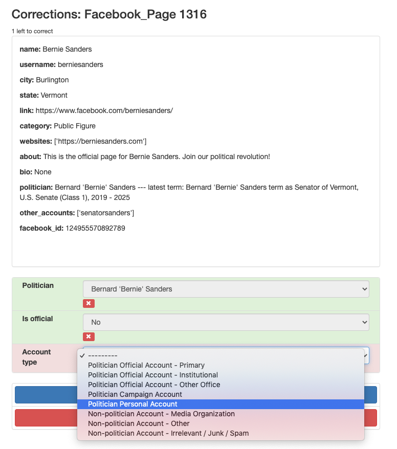

*************************************
Using the interface
*************************************

Django Verifications provides templates and views for an interface, allowing you to easily verify all of the fields
on any objects in your database, and make corrections to those values as needed. To access the interface,
you just need to import the URLs specified in `django_verifications.urls`:

.. code-block:: python

    # Add this to your to your urlpatterns in urls.py

    from django.conf.urls import include
    from django.urls import re_path

    urlpatterns += [re_path(r"^verifications/", include("django_verifications.urls"))]

Now you can navigate to the Django Verifications interface by going to `myapp.com/verifications`

Verifying records
^^^^^^^^^^^^^^^^^^^^^^^^^^^^^

The main landing page for Django Verifications will display all of the models that you have configured
for verification, along with the number of records that are unverified, need correction, and those that
have been fully verified and/or corrected.

If there are any records that need verification, you will see a `Start Coding` button appear. If you click this,
you will enter a coding interface that will randomly pull unverified records from the queue. You will see
all of the data that you specified in your model's `get_verification_metadata()` function, and each field
that you specified in the `fields_to_verify` list in your model's `Meta` section. Using the displayed informaton,
you can check each attribute and indicate whether it's correct or not.  In this example, we have a null value on
this Facebook page's `account_type` field, and we want to fill that in, so we mark it as incorrect.

Correcting records
^^^^^^^^^^^^^^^^^^^^^^^^^^^^^

This record will now be put in the correction queue. When there are records that can be corrected, you will see
a `Make Corrections` button appear.

Clicking this brings you to another coding interface that operates similarly
to the first one, except this time you will be correcting the data that you marked as incorrect. Here, we will
properly fill in the null field and submit the record as corrected. Once fields have been verified and/or corrected,
any attempt to modify their value in the database will raise a `VerifiedFieldLock` exception, preventing any changes
from being made.

